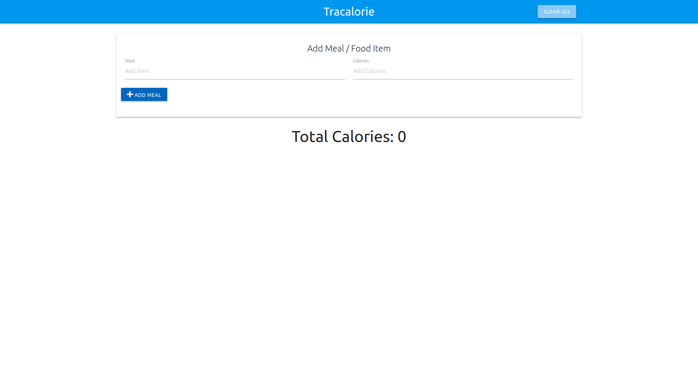

# Tracalorie

> Application for tracking calories.

This project is built with Vanilla Javascript using the Module Design Pattern. The Module Pattern is one of the important patterns in JavaScript. It is a commonly
used Design Pattern which is used to wrap a set of variables and functions together in a single scope. It is used to define objects and specify the variables and
the functions that can be accessed from outside the scope of the function.

## Built With

- HTML5
- CSS3
- JavaScript
## Live Demo

[Live Demo Link](https://zdrale.github.io/Tracalorie/)

## Authors

👤 **Nikola Zdrale**

- GitHub: [@zdrale](https://github.com/zdrale)
- Twitter: [@zdralenikola](https://twitter.com/zdralenikola)
- LinkedIn: [@nikola-zdrale](https://www.linkedin.com/in/nikola-zdrale/)

## 🤝 Contributing

Contributions, issues, and feature requests are welcome!
